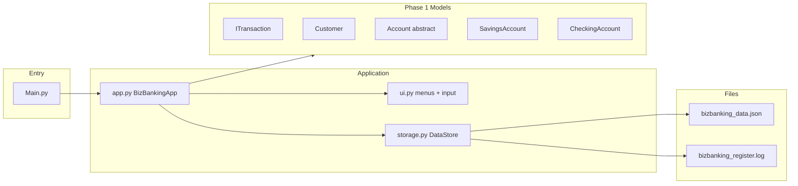
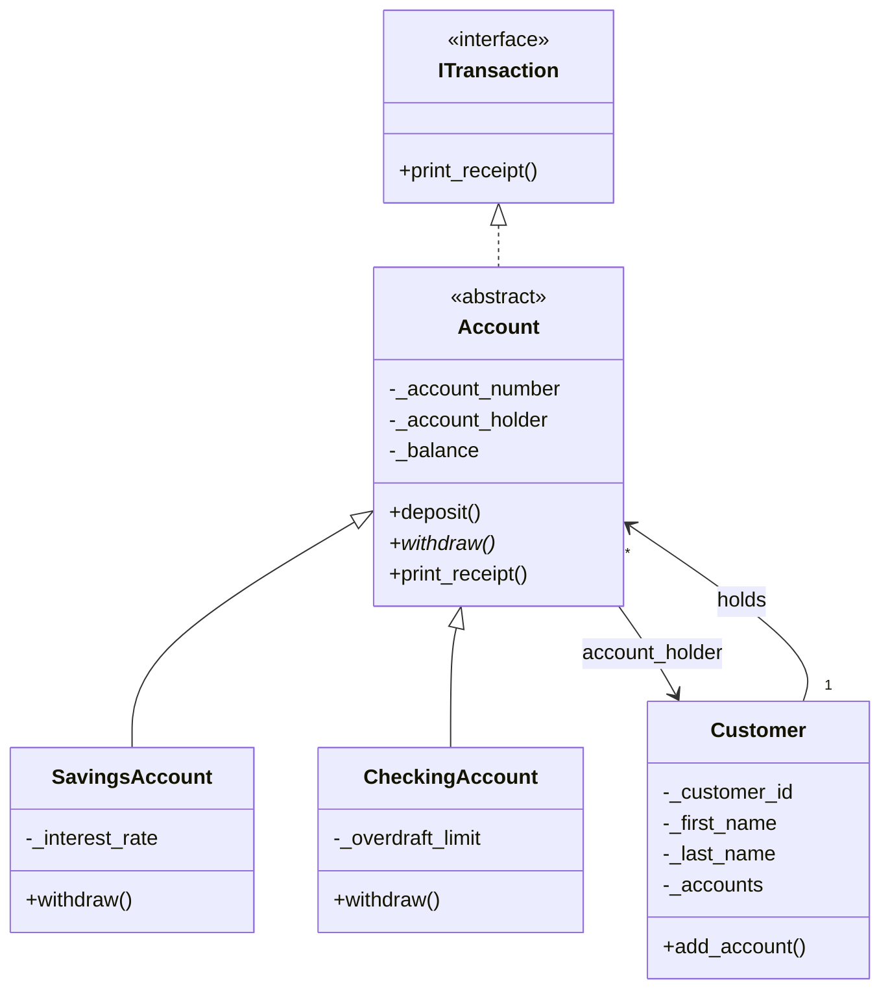

# Architecture

Simple layout: **console UI** → **app logic** → **storage (lists/dicts)** + **OOP models (rules + receipts)**.

## Module map

## Class diagram (OOP)

## Who does what

| File | Role |
|------|------|
| `Main.py` | Starts the app |
| `app.py` | Menus, login, transactions, calls models |
| `ui.py` | Print sections, read input, parse menu text |
| `storage.py` | Load/save JSON, seed data, register log |
| `models/*` | OOP rules and receipts (Phase 1) |
