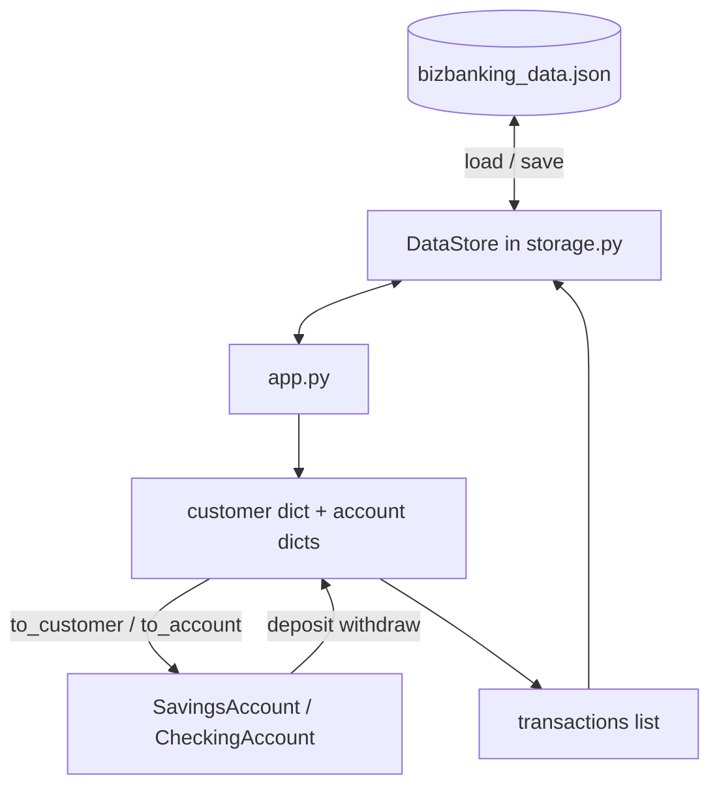
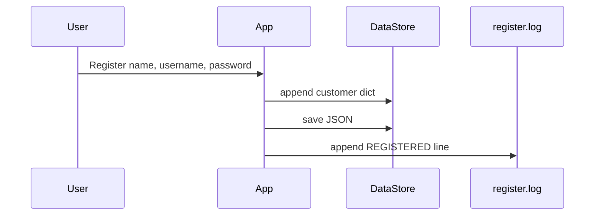

# Data Flow

The app uses **two representations** of the same banking data.

## Why two layers?

| Layer | Format | Used for |
|-------|--------|----------|
| **Storage** | Lists and dicts in JSON | Login, menus, save to disk, loops |
| **Models** | Python classes | Deposit, withdraw, transfer rules, receipts |

JSON is easy to save. Classes enforce **Savings vs Checking** rules (polymorphism).

## Flow diagram

## Example: one withdraw

1. Read `customer` dict from `self.db.customers`
2. Find `account` dict by account number
3. `to_account()` builds `SavingsAccount` or `CheckingAccount`
4. Call `withdraw(amount)` — **rules run here**
5. Write new `balance` back into the dict
6. Append row to `transactions` list
7. `save()` writes JSON file
8. `print_receipt()` on the object

## Register flow

