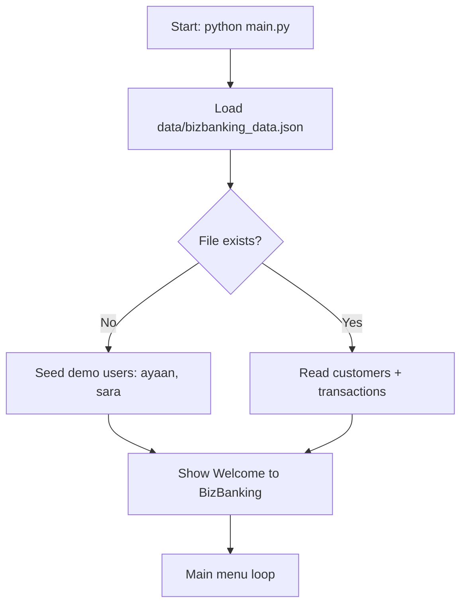
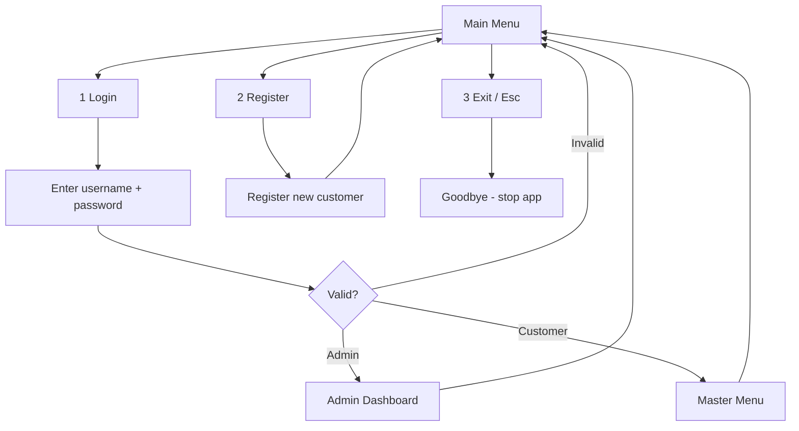
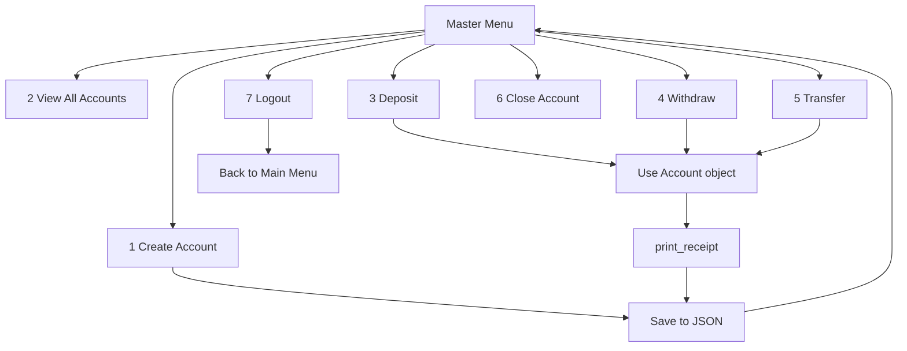
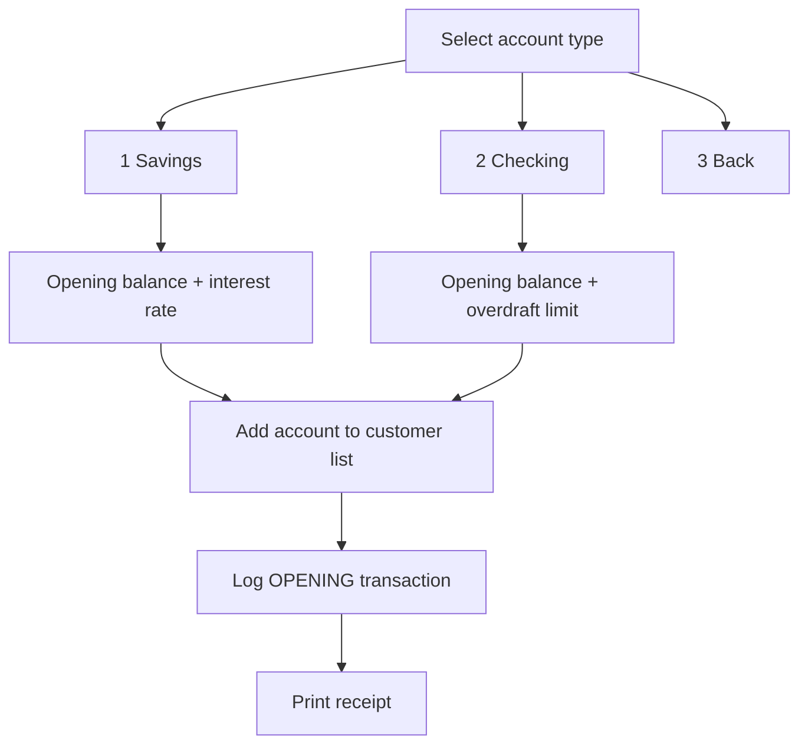
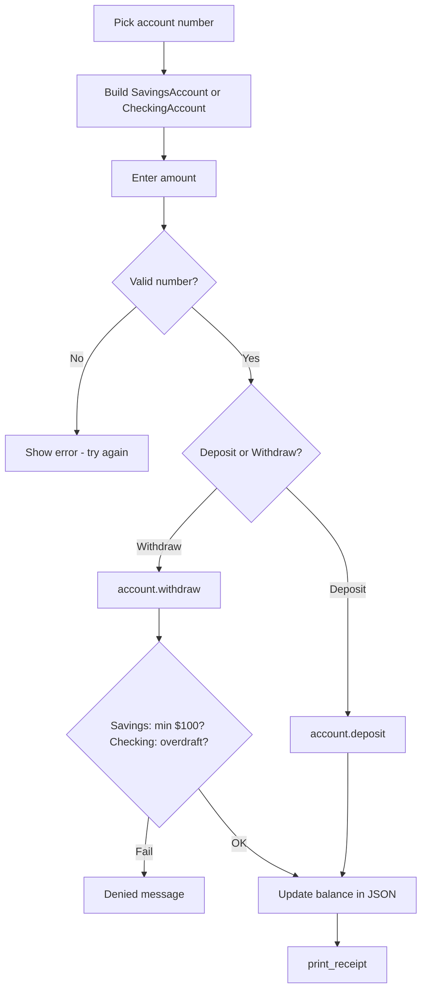
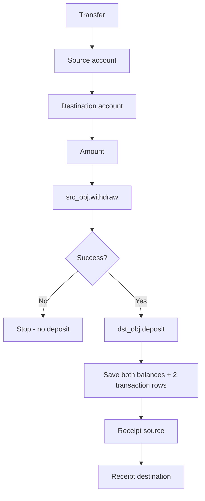
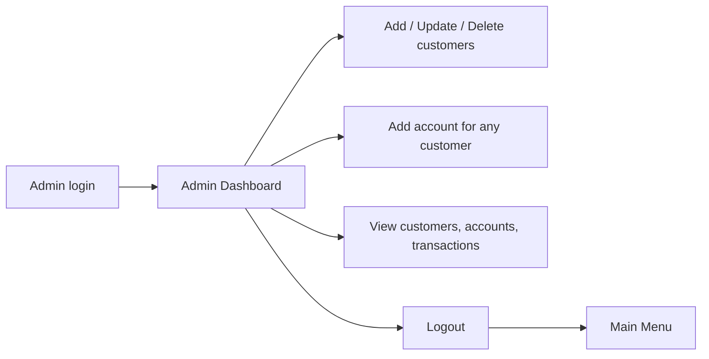

# BizBanking — Thought Flow

High-level path from starting the app to finishing a transaction.

## 1. Application startup

## 2. Main menu (before login)

## 3. Customer master menu (Phase 2)

## 4. Create account (type choice)

## 5. Deposit / withdraw (polymorphism)

## 6. Transfer

## 7. Admin path (short)

